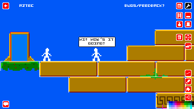
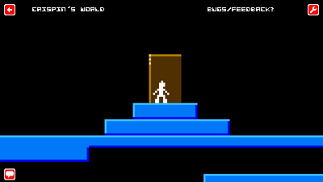

A user-created-content pixel-aesthetic multiplayer game written in the late 2000s using Python and Pygame.

Here's the old trailer which demonstrates the basic concepts (portals, items, level editing) in just under two minutes:

[Here are some old blog posts about the development](https://mccormick.cx/news/tags/infiniteplatformer).

[Here's the old website from The Internet Archive](https://web.archive.org/web/20140111112904/http://infiniteplatformer.com/).

Here's a talk I gave at PyCon AU in 2011 about the game:

I'm no longer working on this so I've put the code up here in case it is useful to somebody else. Enjoy!

## Running ##

Start a local copy of the server:

	python Infinite8BitPlatformerServer.py

Start a copy of the client connecting to the local server:

	python Infinite8BitPlatformer.py localhost

## The old README ##

Infinite 8Bit Platformer is Copyright 2009-2011, Chris McCormick, with contributions from:
* Crispin Wellington 
* Patrick Mullen
* Julian "jug" Habrock
* John Ratke
* Brad Power
* Shanon Loughton

This program is licensed under the terms of the GNU Public License version 3 or higher.
Please see the file COPYING for details.

The program in the server/ subdirectory is licensed under the terms of the AGPL version 3 or higher.
Please see the file server/COPYING for details.
